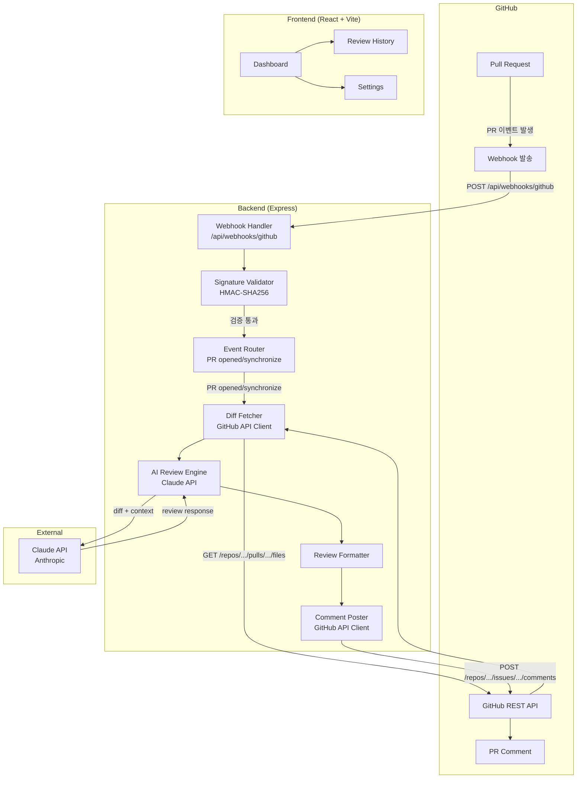
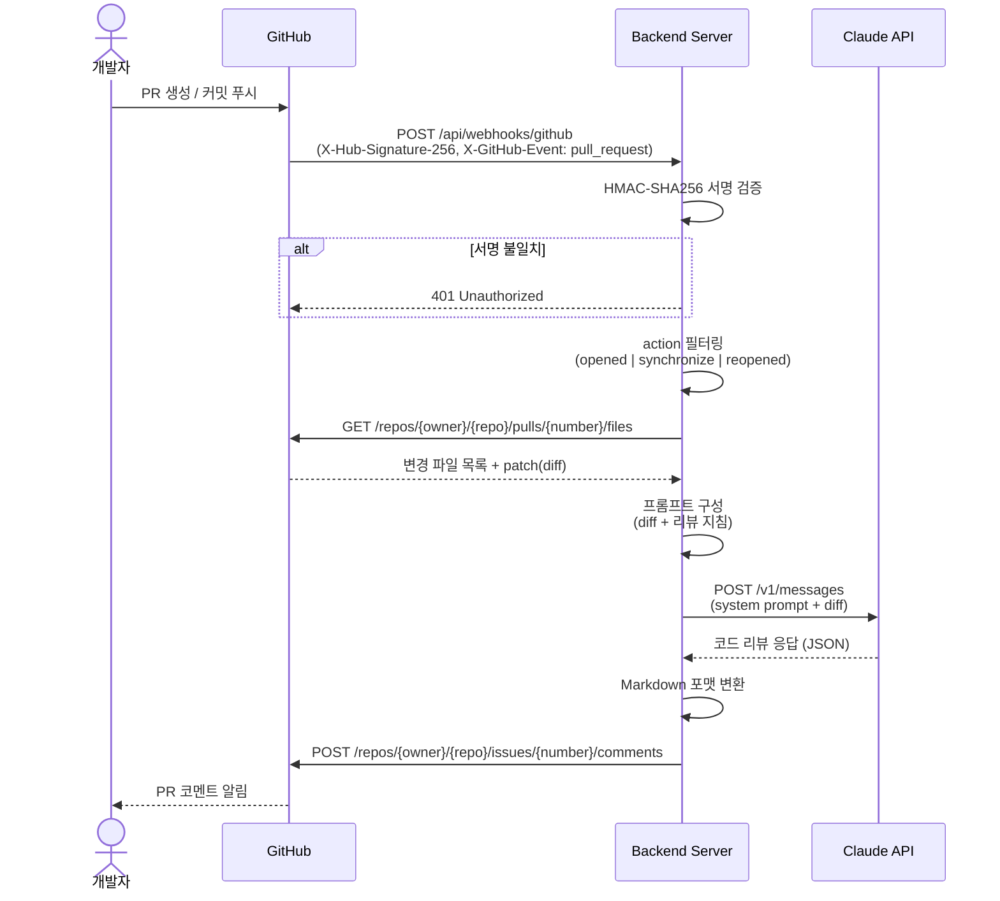

# CodePulse 시스템 아키텍처

## 1. 시스템 개요

CodePulse는 GitHub PR이 생성·업데이트될 때 자동으로 AI 코드 리뷰를 수행하고, 결과를 PR 코멘트로 남기는 시스템이다.

```
GitHub → Webhook → Server → AI Engine → GitHub
```

---

## 2. 컴포넌트 구성



---

## 3. 각 컴포넌트 역할

### 3.1 GitHub (외부)

| 컴포넌트 | 역할 |
|---|---|
| **Pull Request** | 코드 변경 요청 단위. 리뷰 대상 |
| **Webhook 발송** | PR 이벤트(opened, synchronize, reopened) 발생 시 등록된 URL로 HTTP POST |
| **GitHub REST API** | PR diff 조회, 코멘트 작성에 사용 |
| **PR Comment** | AI 리뷰 결과가 최종적으로 표시되는 위치 |

### 3.2 Backend

| 컴포넌트 | 역할 |
|---|---|
| **Webhook Handler** | GitHub에서 오는 POST 요청 수신 진입점 |
| **Signature Validator** | `X-Hub-Signature-256` 헤더로 요청 위변조 검증 |
| **Event Router** | `X-GitHub-Event` 헤더와 `action` 필드로 처리할 이벤트 필터링 |
| **Diff Fetcher** | GitHub API를 통해 변경된 파일 목록과 patch(diff) 수집 |
| **AI Review Engine** | diff와 컨텍스트를 프롬프트로 구성하여 Claude API 호출 |
| **Review Formatter** | AI 응답을 GitHub Markdown 형식의 코멘트로 변환 |
| **Comment Poster** | 완성된 리뷰를 GitHub PR에 코멘트로 게시 |

### 3.3 Frontend

| 컴포넌트 | 역할 |
|---|---|
| **Dashboard** | 리뷰 현황 및 시스템 상태 조회 |
| **Review History** | 과거 AI 리뷰 이력 조회 |
| **Settings** | Webhook 연결, AI 모델 설정, 리뷰 옵션 관리 |

---

## 4. 데이터 흐름

### 4.1 전체 흐름 시퀀스



### 4.2 Webhook 페이로드 핵심 필드

```
POST /api/webhooks/github
Headers:
  X-GitHub-Event: pull_request
  X-Hub-Signature-256: sha256=<hmac>

Body:
{
  action: "opened" | "synchronize" | "reopened",
  pull_request: {
    number: 42,
    title: "feat: 로그인 기능 추가",
    body: "...",
    head: { sha: "abc123", ref: "feat/login" },
    base: { ref: "main" },
    user: { login: "dev-name" },
    additions: 120,
    deletions: 30,
    changed_files: 5
  },
  repository: {
    full_name: "org/repo"
  }
}
```

### 4.3 AI 리뷰 프롬프트 구조

```
System:
  너는 시니어 소프트웨어 엔지니어로서 코드 리뷰를 수행한다.
  다음 관점에서 리뷰하라: 버그, 보안, 성능, 가독성, 테스트

User:
  PR 제목: {title}
  PR 설명: {body}

  변경 파일:
  --- {filename} ---
  {patch}
```
